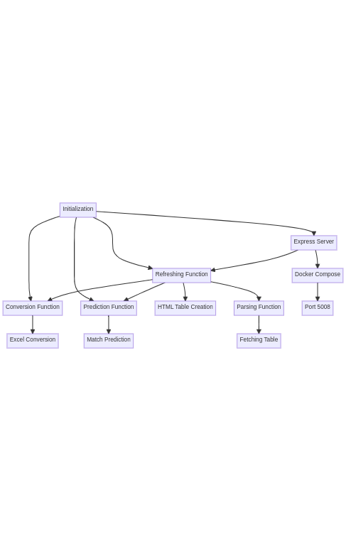

# AFL Match Prediction System

This project is designed to predict the outcomes of Australian Football League (AFL) matches. It fetches current match data, converts Excel files to CSV, and utilizes TensorFlow.js to build a predictive model.

## Features

- Fetching current match data from a specified URL.
- Converting Excel files containing historical data to CSV format.
- Building and training a predictive model using TensorFlow.js.
- Hosting the predictions as an HTML table on an Express server.
- Containerizing the application using Docker.

## Prerequisites

- Node.js (v14 or higher)
- Docker (if using the provided `docker-compose.yml`)

## Installation

1. Clone the repository:

   ```bash
   git clone https://github.com/your-username/afl-match-prediction.git
   cd afl-match-prediction
   docker-compose up --build
   ```

   
